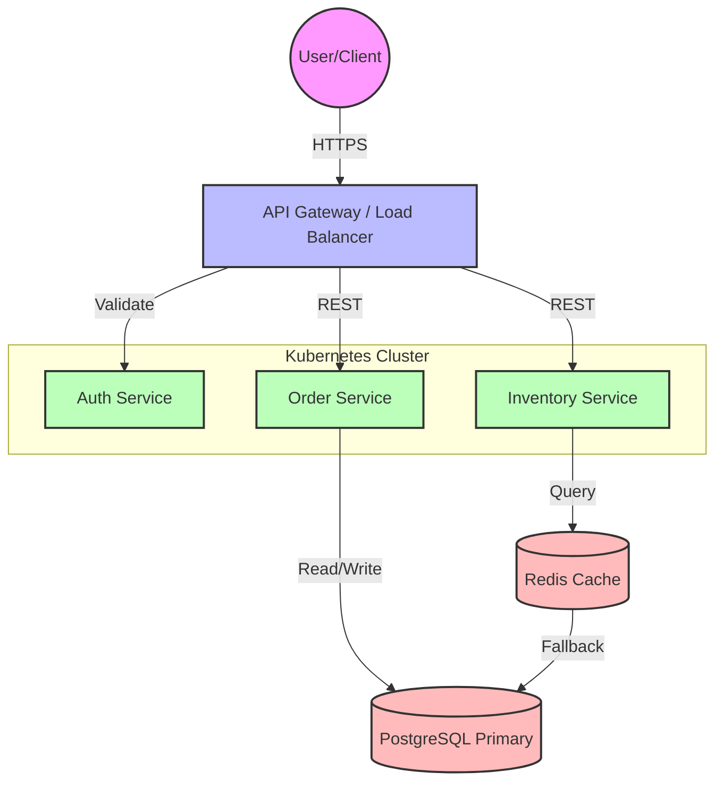

```mermaid
flowchart TD
    %% Define Styles
    classDef client fill:#f9f,stroke:#333,stroke-width:2px;
    classDef bff fill:#bbf,stroke:#333,stroke-width:2px;
    classDef service fill:#bfb,stroke:#333,stroke-width:2px;
    classDef database fill:#fbb,stroke:#333,stroke-width:2px;

    %% Elements
    User((User/Client))
    Gateway[API Gateway / Load Balancer]
    
    subgraph K8s [Kubernetes Cluster]
        Auth[Auth Service]
        Order[Order Service]
        Inventory[Inventory Service]
    end

    Cache[(Redis Cache)]
    DB[(PostgreSQL Primary)]

    %% Apply Styles Safely
    class User client;
    class Gateway bff;
    class Auth,Order,Inventory service;
    class Cache,DB database;

    %% Connections
    User -->|HTTPS| Gateway
    Gateway -->|Validate| Auth
    Gateway -->|REST| Order
    Gateway -->|REST| Inventory
    
    Order -->|Read/Write| DB
    Inventory -->|Query| Cache
    Cache -->|Fallback| DB
```
